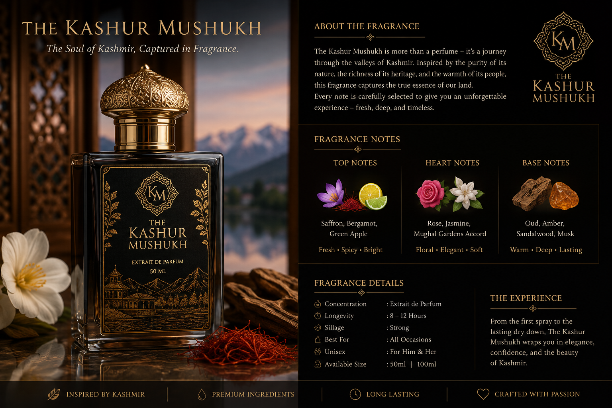

```html
<!DOCTYPE html>
<html lang="en">
<head>
  <meta charset="UTF-8">
  <meta name="viewport" content="width=device-width, initial-scale=1.0">

  <title>The Kashur Mushukh | A Fragrance from Kashmir</title>

  <meta name="description"
        content="The Kashur Mushukh — a Kashmir-inspired luxury fragrance created with elegance, memory and the soul of the valley.">

  <link rel="preconnect" href="https://fonts.googleapis.com">
  <link rel="preconnect" href="https://fonts.gstatic.com" crossorigin>

  <link href="https://fonts.googleapis.com/css2?family=Cormorant+Garamond:wght@400;500;600;700&family=Montserrat:wght@300;400;500;600&display=swap" rel="stylesheet">

  <link rel="stylesheet" href="style.css">
</head>

<body>

  <!-- ================= HEADER ================= -->

  <header class="site-header">

    <div class="container nav-container">

      <a href="#home" class="brand">
        <span class="brand-main">KASHUR MUSHUKH</span>
        <span class="brand-sub">A FRAGRANCE FROM KASHMIR</span>
      </a>

      <button class="menu-toggle" aria-label="Open navigation">
        <span></span>
        <span></span>
        <span></span>
      </button>

      <nav class="navigation">
        <a href="#home">Home</a>
        <a href="#story">Our Story</a>
        <a href="#fragrance">The Fragrance</a>
        <a href="#collection">Collection</a>
        <a href="#contact">Contact</a>
      </nav>

    </div>

  </header>


  <main>

    <!-- ================= HERO ================= -->

    <section id="home" class="hero">

      <div class="hero-overlay"></div>

      <div class="container hero-content">

        <p class="eyebrow">BORN IN KASHMIR</p>

        <h1>
          A Fragrance<br>
          <em>That Remembers.</em>
        </h1>

        <p class="hero-description">
          Inspired by the mountains, gardens and timeless soul of Kashmir,
          The Kashur Mushukh is a fragrance created to turn memories into
          something you can wear.
        </p>

        <div class="hero-buttons">

          <a href="#collection" class="btn btn-primary">
            Discover the Fragrance
          </a>

          <a href="#story" class="btn btn-outline">
            Our Story
          </a>

        </div>

      </div>

    </section>


    <!-- ================= INTRO ================= -->

    <section class="intro-section">

      <div class="container intro-grid">

        <div class="intro-heading">

          <p class="eyebrow">THE ESSENCE OF KASHMIR</p>

          <h2>
            More than a perfume.<br>
            <em>A memory of home.</em>
          </h2>

        </div>

        <div class="intro-text">

          <p>
            Kashmir has always been more than a place. It is a feeling —
            the silence of snow-covered mountains, the fragrance of flowers
            carried by a valley breeze, and memories that remain long after
            we leave.
          </p>

          <p>
            The Kashur Mushukh was created from that feeling.
            A contemporary fragrance inspired by the heritage and beauty
            of Kashmir.
          </p>

        </div>

      </div>

    </section>


    <!-- ================= STORY ================= -->

    <section id="story" class="story-section">

      <div class="container story-grid">

        <div class="story-image">

          

        </div>

        <div class="story-content">

          <p class="eyebrow">OUR STORY</p>

          <h2>
            From the valley,<br>
            <em>with a story to tell.</em>
          </h2>

          <p>
            The Kashur Mushukh is an ode to Kashmir — its landscapes,
            its traditions and the emotions attached to a place that
            stays with you wherever life takes you.
          </p>

          <p>
            We believe fragrance should not simply make you smell good.
            It should evoke something. A person. A season. A place.
            A moment you never want to forget.
          </p>

          <p>
            That philosophy is at the heart of The Kashur Mushukh.
          </p>

          <a href="#fragrance" class="text-link">
            Explore the fragrance →
          </a>

        </div>

      </div>

    </section>


    <!-- ================= FRAGRANCE ================= -->

    <section id="fragrance" class="fragrance-section">

      <div class="container">

        <div class="section-heading">

          <p class="eyebrow">THE SIGNATURE</p>

          <h2>
            A scent inspired by<br>
            <em>the valley of Kashmir.</em>
          </h2>

          <p>
            Elegant. Warm. Unforgettable.
          </p>

        </div>


        <div class="notes-grid">

          <div class="note-card">

            <span class="note-number">01</span>

            <h3>Opening</h3>

            <p>
              A fresh and captivating beginning inspired by the crisp
              mountain air of Kashmir.
            </p>

          </div>


          <div class="note-card">

            <span class="note-number">02</span>

            <h3>Heart</h3>

            <p>
              A refined floral character reflecting the gardens and
              blossoms of the valley.
            </p>

          </div>


          <div class="note-card">

            <span class="note-number">03</span>

            <h3>Base</h3>

            <p>
              Deep, warm and memorable — leaving a sophisticated trail
              that lingers long after the moment.
            </p>

          </div>

        </div>

      </div>

    </section>


    <!-- ================= COLLECTION ================= -->

    <section id="collection" class="collection-section">

      <div class="container">

        <div class="section-heading">

          <p class="eyebrow">THE COLLECTION</p>

          <h2>
            Meet <em>Kashur Mushukh</em>
          </h2>

          <p>
            Your signature fragrance from Kashmir.
          </p>

        </div>


        <div class="product-card">

          <div class="product-image">

            

          </div>


          <div class="product-details">

            <p class="product-label">
              SIGNATURE FRAGRANCE
            </p>

            <h3>
              The Kashur Mushukh
            </h3>

            <p class="product-description">
              A sophisticated fragrance inspired by the soul of Kashmir.
              Designed for those who carry their memories wherever they go.
            </p>


            <div class="product-meta">

              <div>
                <span>SIZE</span>
                <strong>50 ML</strong>
              </div>

              <div>
                <span>TYPE</span>
                <strong>EAU DE PARFUM</strong>
              </div>

            </div>


            <div class="product-price">
              ₹ ——
            </div>

            <p class="price-note">
              Price to be announced
            </p>


            <a
              href="#contact"
              class="btn btn-primary product-button"
            >
              Enquire / Order
            </a>

          </div>

        </div>

      </div>

    </section>


    <!-- ================= QUOTE ================= -->

    <section class="quote-section">

      <div class="container">

        <p class="quote-mark">“</p>

        <blockquote>
          Some places are not left behind.
          <br>
          They stay with you.
        </blockquote>

        <p class="quote-credit">
          — THE KASHUR MUSHUKH
        </p>

      </div>

    </section>


    <!-- ================= CONTACT ================= -->

    <section id="contact" class="contact-section">

      <div class="container contact-container">

        <div>

          <p class="eyebrow">CONNECT WITH US</p>

          <h2>
            Carry a little<br>
            <em>Kashmir with you.</em>
          </h2>

          <p>
            For fragrance enquiries, orders and collaborations,
            get in touch with us directly.
          </p>

        </div>


        <div class="contact-actions">

          <a
            href="https://wa.me/917889420904"
            target="_blank"
            rel="noopener"
            class="btn btn-primary"
          >
            Order on WhatsApp
          </a>

          <a
            href="https://www.instagram.com/"
            target="_blank"
            rel="noopener"
            class="btn btn-outline"
          >
            Follow on Instagram
          </a>

        </div>

      </div>

    </section>

  </main>


  <!-- ================= FOOTER ================= -->

  <footer class="site-footer">

    <div class="container footer-container">

      <div>

        <div class="footer-brand">
          KASHUR MUSHUKH
        </div>

        <p>
          A fragrance from Kashmir.
        </p>

      </div>


      <div class="footer-links">

        <a href="#home">Home</a>
        <a href="#story">Our Story</a>
        <a href="#fragrance">Fragrance</a>
        <a href="#collection">Collection</a>
        <a href="#contact">Contact</a>

      </div>

    </div>


    <div class="container footer-bottom">

      <p>
        © <span id="year"></span> The Kashur Mushukh. All rights reserved.
      </p>

      <p>
        Made with the spirit of Kashmir.
      </p>

    </div>

  </footer>


  <script src="script.js"></script>

</body>
</html>
```
